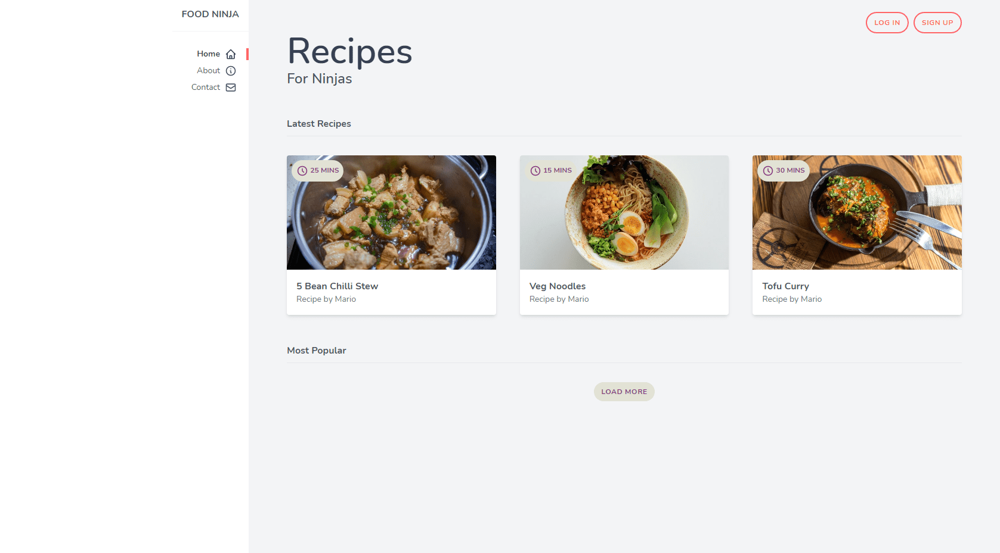
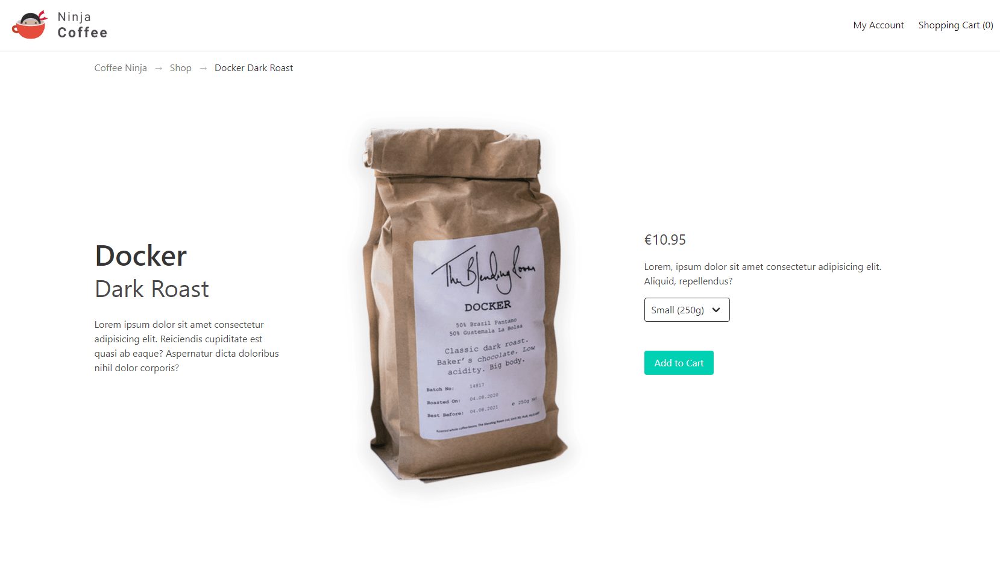

# CSS Frameworks

This repo is made of 3 projects:

1. [**Food Ninja**](#food): A recipe website to understand Tailwind CSS basics.
2. [**Ninja Coffee**](#coffee): A product page to understand Bulma basics.
3. [**Photo Ninja**](#photo): A photography portfolio website to learn Materialize basics.

## 1) Food Ninja - Tailwind CSS

A recipe website to understand Tailwind CSS basics.

[See food-ninja folder](https://github.com/solygambas/html-css-frameworks/tree/master/food-ninja)

    

### Features

- setting up Tailwind CSS for development.
- handling fonts, colors, margin, padding and borders.
- extending theme colors and customizing font with tailwind.config.js.
- using flexbox, grid and responsive classes.
- reusing classes for cards, badges and buttons with @apply directive.
- displaying icons from Heroicons.
- building a responsive navbar.
- adding effects and transitions on hover.

Based on [Tailwind CSS Tutorial](https://www.youtube.com/playlist?list=PL4cUxeGkcC9gpXORlEHjc5bgnIi5HEGhw) by Shaun Pelling - The Net Ninja (2020).

## 2) Ninja Coffee - Bulma

A product page to understand Bulma basics.

[See Demo on CodePen](https://codepen.io/solygambas/full/KKWzKxw)

[See ninja-coffee folder](https://github.com/solygambas/html-css-frameworks/tree/master/ninja-coffee)

    

### Features

- handling font sizes and colors with Bulma.
- working with section, container and spacing classes.
- building a navbar for desktop and mobile with a burger menu.
- adding some breadcrumbs, a message box and a footer.
- playing with grid columns and responsive classes.
- generating cards for related products.
- using tabs and rendering a modal with JavaScript.
- creating a form with text, checkbox and select fields.

Based on [Bulma CSS Tutorial](https://www.youtube.com/playlist?list=PL4cUxeGkcC9iXItWKbaQxcyDT1u6E7a8a) by Shaun Pelling - The Net Ninja (2020).

## 3) Photo Ninja - Materialize

A photography portfolio website to learn Materialize basics.

<!-- [See Demo on CodePen](https://codepen.io/solygambas/full/KKWzKxw) -->

[See photo-ninja folder](https://github.com/solygambas/html-css-frameworks/tree/master/photo-ninja)

<!-- 

    

 -->

### Features

-

Based on [Materialize Tutorial](https://www.youtube.com/playlist?list=PL4cUxeGkcC9gGrbtvASEZSlFEYBnPkmff) by Shaun Pelling - The Net Ninja (2018).
