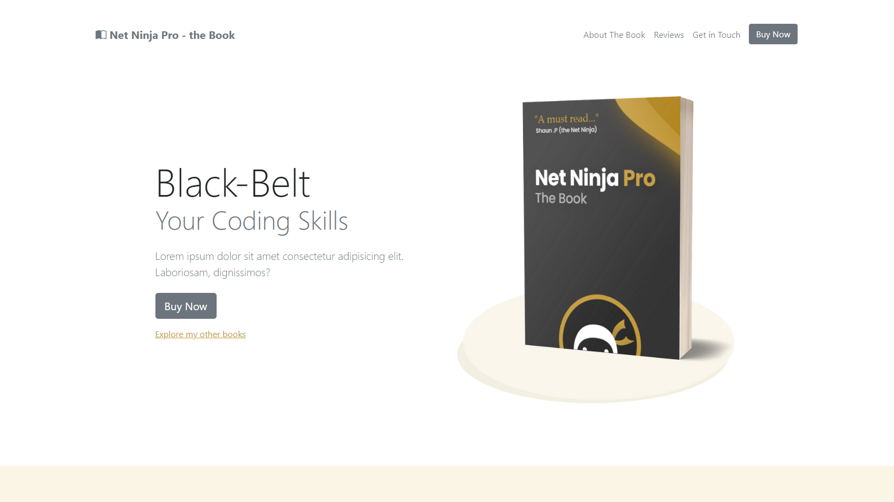

# Ebook Landing Page - Bootstrap 5

A responsive landing page with Bootstrap 5.

[See Demo on CodePen](https://codepen.io/solygambas/full/oNWymQV)

    

## Features

- discovering Bootstrap 5 new features.
- exploring colors, typography, button and utility classes.
- playing with containers, grid layout and cards.
- using navbar, list group, tooltips, tabs and dropdowns.
- working with forms, modals and offcanvas.
- displaying Bootstrap Icons.
- customizing Bootstrap colors with Sass.

Based on [Bootstrap 5 Crash Course Tutorial](https://www.youtube.com/playlist?list=PL4cUxeGkcC9joIM91nLzd_qaH_AimmdAR) by Shaun Pelling - The Net Ninja (2021).
