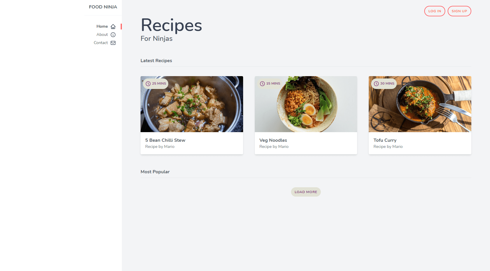

# Food Ninja - Tailwind CSS

A recipe website to understand Tailwind CSS basics.

    

## Features

- setting up Tailwind CSS for development.
- handling fonts, colors, margin, padding and borders.
- extending theme colors and customizing font with tailwind.config.js.
- using flexbox, grid and responsive classes.
- reusing classes for cards, badges and buttons with @apply directive.
- displaying icons from Heroicons.
- building a responsive navbar.
- adding effects and transitions on hover.

Based on [Tailwind CSS Tutorial](https://www.youtube.com/playlist?list=PL4cUxeGkcC9gpXORlEHjc5bgnIi5HEGhw) by Shaun Pelling - The Net Ninja (2020).
