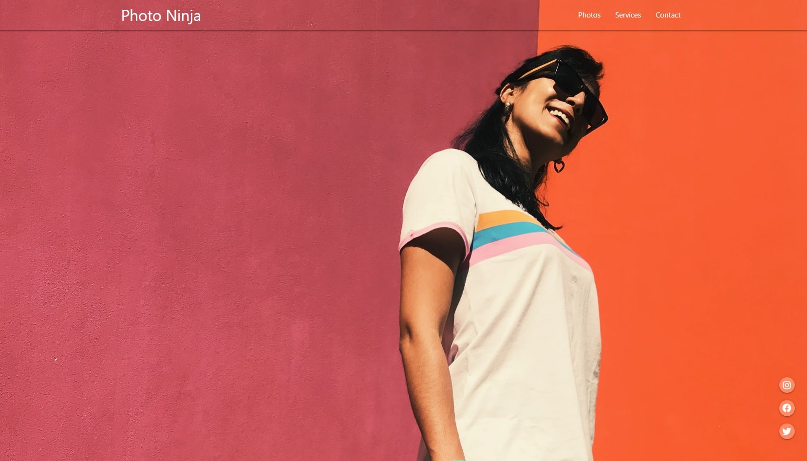

# Photo Ninja - Materialize

A photography portfolio website to learn Materialize basics.

[See Demo on CodePen](https://codepen.io/solygambas/full/poebvRy)

    

## Features

- formatting texts and handling colors with Materialize.
- displaying icons from Material Icons and Font Awesome.
- creating a header for desktop and mobile with a burger menu and a sidenav.
- building a responsive grid.
- pushing, pulling and hiding content according to screen size.
- using Materialize JavaScript for tabs.
- rendering images with lightbox and parallax tools.
- generating a form with a built-in date picker and handling buttons.
- customizing colors and displaying tooltips next to social icons.
- adding a footer and enabling smooth scroll with scrollspy.

Based on [Materialize Tutorial](https://www.youtube.com/playlist?list=PL4cUxeGkcC9gGrbtvASEZSlFEYBnPkmff) by Shaun Pelling - The Net Ninja (2018).
