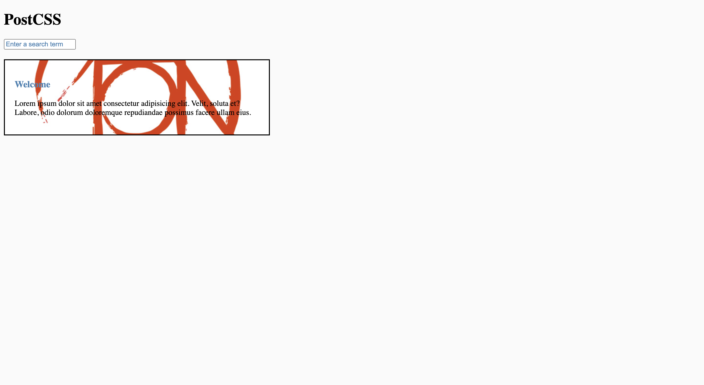

# PostCSS

A quick intro to PostCSS.

    

## Features

- setting up a project with PostCSS.
- using Autoprefixer to add vendor prefixes to CSS rules.
- testing modern CSS features with PostCSS Preset Env.
- enabling Sass-like markup with PreCSS.
- importing variables and CSS files with postcss-import.
- managing assets with postcss-assets.
- optimizing CSS with cssnano.

Based on [PostCSS Crash Course](https://www.youtube.com/watch?v=SP8mSVSAh6s) by Brad Traversy (2022).
